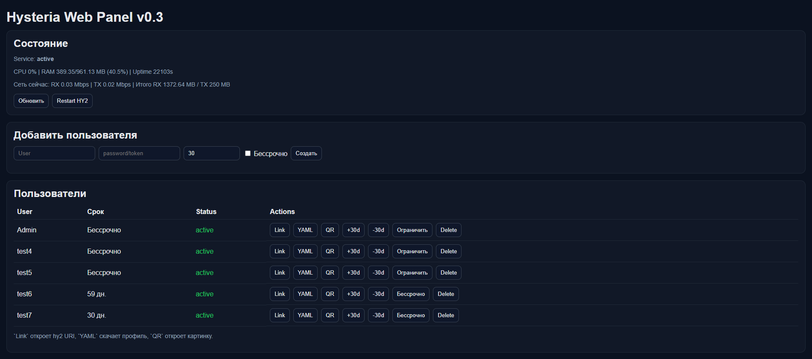

# Hysteria Web Panel (MVP)

Минимальная FastAPI-панель для управления пользователями Hysteria2 и просмотра состояния сервера.

## Возможности

- Вход администратора по логину/паролю (Bearer token)
- Встроенный web UI по пути `/`
- Статус системы: CPU, RAM, диск, uptime
- Статус сервиса Hysteria (`systemctl is-active`)
- Список пользователей из `auth.userpass`
- Добавление/обновление пользователя в `/etc/hysteria/config.yaml`
- Удаление пользователя из `/etc/hysteria/config.yaml`
- Генерация `hy2://` ссылки для пользователя
- Выгрузка YAML-профиля
- Генерация QR-кода
- Интеграционный endpoint для ботов: `POST /add-client` с `X-API-Key`

## Скриншоты

Добавляйте изображения в `docs/images/` и вставляйте ссылки в README:

```md

```

## Быстрый старт (локально/dev)

1. Создать и активировать виртуальное окружение:

```bash
python -m venv .venv
source .venv/bin/activate
```

2. Установить зависимости:

```bash
pip install -r requirements.txt
```

3. Создать `.env`:

```bash
cp .env.example .env
```

4. Заполнить переменные в `.env`:

- `HWP_ADMIN_USER`
- `HWP_ADMIN_PASSWORD`
- `HWP_HYSTERIA_CONFIG_PATH`
- `HWP_HYSTERIA_SERVICE_NAME`
- `HWP_PUBLIC_DOMAIN`
- `HWP_PUBLIC_PORT` (опционально, по умолчанию `443`)
- `HWP_PUBLIC_SNI` (опционально, по умолчанию как домен)
- `HWP_API_KEYS` (ключи для интеграций, через запятую)

5. Запустить сервер:

```bash
uvicorn app.main:app --host 0.0.0.0 --port 8080 --reload
```

Открыть:
- Swagger: `http://127.0.0.1:8080/docs`
- UI: `http://127.0.0.1:8080/`

## Установка одной командой (Ubuntu 24.04)

После публикации репозитория на GitHub:

```bash
curl -fsSL https://raw.githubusercontent.com/cwash797-cmd/hysteria-web-panel-rixxx/main/scripts/install.sh | \
sudo REPO_URL="https://github.com/cwash797-cmd/hysteria-web-panel-rixxx.git" \
HWP_PUBLIC_DOMAIN="gprime.mooo.com" \
bash
```

По умолчанию панель слушает только `127.0.0.1:8080`. Для внешнего доступа используйте Cloudflare Tunnel.

## Чек-лист для нового сервера

См. `docs/NEW_SERVER_CHECKLIST_RU.md` — полный список, что и где менять при новом VPS/IP.
Перед публикацией на GitHub пройдите `docs/RELEASE_CHECKLIST_RU.md`.

## API сценарий

1. `POST /api/auth/login` -> получить токен.
2. Передавать `Authorization: Bearer <token>`.
3. Использовать endpoints:
   - `GET /api/system/status`
   - `GET /api/hysteria/status`
   - `GET /api/hysteria/users`
   - `POST /api/hysteria/users`
   - `DELETE /api/hysteria/users`
   - `GET /api/hysteria/users/{username}/link`
   - `GET /api/hysteria/users/{username}/yaml`
   - `GET /api/hysteria/users/{username}/qr`

## Интеграция с ботом (совместимо с Cloudflare Worker)

`POST /add-client` с заголовком:

- `X-API-Key: <один из HWP_API_KEYS>`

Пример body:

```json
{
  "tg_id": "12345678",
  "plan": "1m",
  "order_id": "trbt_abc123"
}
```

Endpoint также принимает legacy-поля: `uuid` и `email`.

Пример ответа:

```json
{
  "success": true,
  "message": "client issued",
  "username": "tg_12345678_trbt_abc123",
  "expiry_ms": 1773000000000,
  "link": "hy2://...",
  "restart": { "ok": true, "message": "hysteria-server restarted" }
}
```

## Smoke-тест после деплоя

На сервере:

```bash
cd /opt/hysteria-web-panel
ADMIN_PASS='<your_admin_password>' PANEL_URL='http://127.0.0.1:8080' bash scripts/smoke_test.sh
```

## Linux service (опционально)

Создать `/etc/systemd/system/hwp.service`:

```ini
[Unit]
Description=Hysteria Web Panel
After=network.target

[Service]
WorkingDirectory=/opt/hysteria-web-panel
ExecStart=/opt/hysteria-web-panel/.venv/bin/uvicorn app.main:app --host 127.0.0.1 --port 8080
Restart=always
User=root

[Install]
WantedBy=multi-user.target
```

Запуск:

```bash
systemctl daemon-reload
systemctl enable --now hwp
systemctl status hwp --no-pager
```

## Безопасность

- MVP хранит токены в памяти процесса.
- Панель лучше держать за reverse proxy с HTTPS.
- Ограничивайте доступ к панели (IP allowlist/Basic Auth).
- Запускайте панель на Linux, где доступны `systemctl` и `/etc/hysteria/config.yaml`.
- Подробно: `docs/SECURITY.md`
- Деплой-процесс: `docs/DEPLOYMENT.md`
- Файлы `.env` и `panel.db` не должны попадать в Git (добавлено в `.gitignore`).
